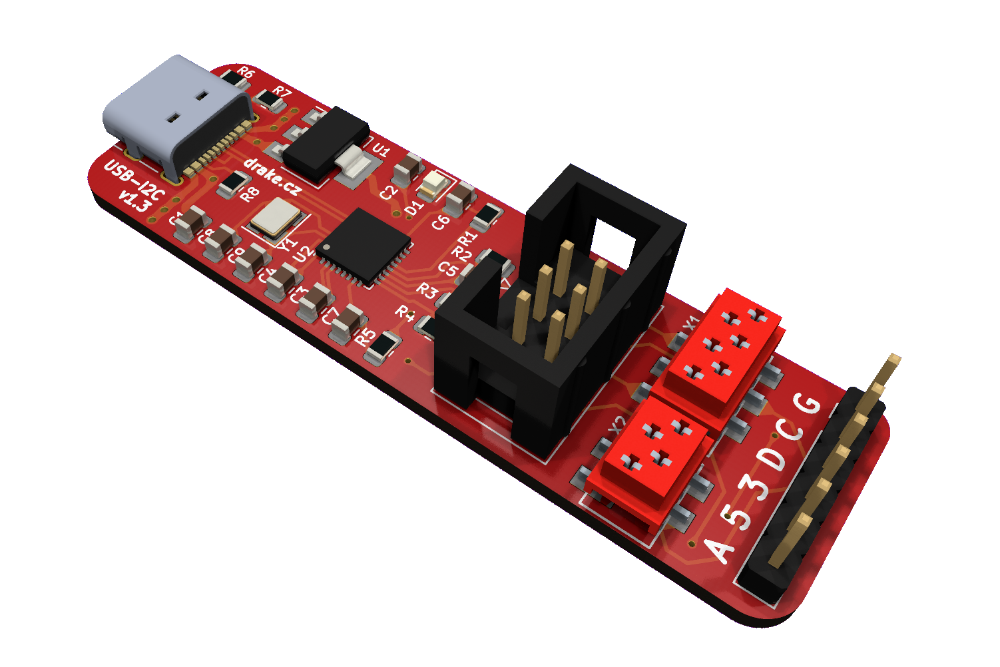

# USB-I2C bridge

USB to I2C bridge implemented on ESP32-C3FN4 MCU.



## Features

## Connectors

All connectors have the same pin-out as follows.

1. GND
2. SCL
3. SDA
4. +3.3 V
5. +5V
6. ALERT (IRQ)

## Binding

For Node.js there is a library [i2c-js](https://github.com/burgrp/i2c-js) published on NPM as [@burgrp/i2c](https://www.npmjs.com/package/@burgrp/i2c).

## USB protocol

- VID: 303A
- PID: 1001

The bridge is controlled through serial port by simple text protocol:

- `S` scans bus for devices, replies `Saddr1,addr2,addr3,...`
- `R,addr,len` reads data from device, replies `R,hex_data`
- `W,addr,hex_data` writes data to device, replies `W,acked_count`
- `A` gets alert line status, replies `AT` (true) or `AF` (false).

### Example

By commands `S`, `R,79,2`, `A` we can scan the bus, read temperature from LM75A sensor found on address 79 and check the alert line:

```
> miniterm /dev/ttyACM0 115200 --raw
--- Miniterm on /dev/ttyACM0  115200,8,N,1 ---
--- Quit: Ctrl+] | Menu: Ctrl+T | Help: Ctrl+T followed by Ctrl+H ---
S
S79
R,79,2
R1A40
A
AF
```


## License
This work is licensed under a Creative Commons Attribution-ShareAlike 4.0 International License.